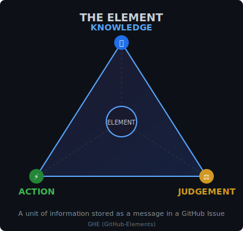
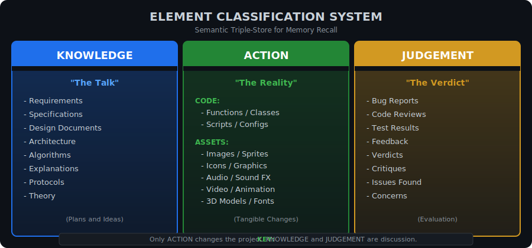

<div align="center">

# GHE

### **G**it**H**ub-**E**lements

**Persistent Memory for Claude Code**

[](https://github.com/Emasoft/ghe-marketplace/releases/tag/ghe-v0.6.23)
[](https://github.com/Emasoft/ghe-marketplace/releases)
[](LICENSE)
[](https://docs.anthropic.com/en/docs/claude-code)
[](https://github.com/Emasoft/ghe-marketplace/issues)
[](https://github.com/Emasoft/ghe-marketplace)

*Turn GitHub Issues into a persistent memory system for AI agents.*

</div>

---

<!-- PLUGIN-VERSIONS-START -->
## Plugin Versions

| Plugin | Version | Description |
|--------|---------|-------------|
| ghe | 0.6.23 | GHE (GitHub-Elements) - Automated project management for ... |
| marketplace-utils | 1.0.0 | Portable utility tools for Claude Code plugin marketplace... |

*Last updated: 2025-12-07*

<!-- PLUGIN-VERSIONS-END -->

## Table of Contents

- [What is GHE?](#what-is-ghe)
- [The Element](#the-element)
  - [Element of Knowledge](#element-of-knowledge)
  - [Element of Action](#element-of-action)
  - [Element of Judgement](#element-of-judgement)
- [Why GHE?](#why-ghe)
  - [SESSION CONTINUITY](#session-continuity)
  - [ON TRACK](#on-track)
  - [ALIGNED TEAM WORK](#aligned-team-work)
  - [PERFECT MEMORY](#perfect-memory)
  - [EPIC THREADS](#epic-threads)
  - [How WAVES Work](#how-waves-work)
- [Installation](#installation)
  - [Option 1: Add Marketplace (Recommended)](#option-1-add-marketplace-recommended)
  - [Option 2: Manual Clone](#option-2-manual-clone)
- [Post-Installation](#post-installation)
- [Prerequisites](#prerequisites)
  - [1. Claude Code](#1-claude-code)
  - [2. GitHub CLI](#2-github-cli)
- [Plugin Contents](#plugin-contents)
  - [GHE v0.6.23](#ghe-v0623)
  - [Agents](#agents)
  - [Argos Panoptes - The All-Seeing Guardian](#argos-panoptes-the-all-seeing-guardian)
  - [Skills](#skills)
- [Marketplace Utils Plugin](#marketplace-utils-plugin)
  - [marketplace-release](#marketplace-release)
  - [markdown-toc](#markdown-toc)
- [Workflow](#workflow)
  - [Phase Promotion with Themis](#phase-promotion-with-themis)
- [Troubleshooting](#troubleshooting)
  - [Claude doesn't see the plugin](#claude-doesnt-see-the-plugin)
  - [GitHub CLI says "not logged in"](#github-cli-says-not-logged-in)
  - [The /ghe:setup command doesn't work](#the-ghesetup-command-doesnt-work)
  - [Claude forgets everything after compaction](#claude-forgets-everything-after-compaction)
  - [I see errors about "permission denied"](#i-see-errors-about-permission-denied)
  - [Still stuck?](#still-stuck)
- [Updating](#updating)
- [Uninstalling](#uninstalling)
- [Contributing](#contributing)
- [Support](#support)
- [Acknowledgments](#acknowledgments)
- [License](#license)


> **ALPHA** - This plugin is in early development. APIs and workflows may change.

## What is GHE?

GHE is a Claude Code plugin that transforms GitHub Issues into a **persistent memory system** for AI-assisted development. Your work survives context compaction, your team stays synchronized, and nothing gets lost.

| Multi-session continuity | Automated workflow | Team collaboration | Perfect recall |
|:---:|:---:|:---:|:---:|
| Continue where you left off | DEV &rarr; TEST &rarr; REVIEW | Humans + AI in sync | Every detail preserved |

---

## The Element

<p align="center">
  
</p>

An **Element** is a unit of information stored as a single message/reply to a GitHub Issue in the issue tracker. Every piece of information in GHE is an Element.

<p align="center">
  
</p>

**The power of this system**: GitHub threads allow you to **isolate and preserve the context of each task**. Human developers and AI agents can discuss progress while keeping the conversation focused and on track, instead of mixing different issues together.

At any moment, you can tell Claude: *"Let's switch to working on issue #42"* - and Claude instantly gets up to speed by reading that issue's thread. It spawns a subagent to read and summarize the thread, so it won't waste your tokens or context memory. Each issue is a self-contained knowledge base for its task.

There are **3 types of Elements**:

### Element of Knowledge

A message describing **plans, ideas, and theory** - discussion that informs but doesn't change the project:
- Requirements, specifications, design documents
- Architecture decisions, algorithms, protocols
- APIs, data structures, formats
- Explanations, documentation, theory

> "The Talk" - Plans and ideas before they become reality.

### Element of Action

A message containing or linking **tangible project artifacts** - the only element type that actually changes the project:

**CODE:**
- Code snippets, patches, diffs
- Functions, classes, scripts
- Configuration files

**ASSETS:**
- Images, sprites, icons, graphics
- Audio, sound effects, music
- Video, animations
- 3D models, textures
- Stylesheets, fonts

> "The Reality" - If it ships with the project, it's an ACTION.

### Element of Judgement

A message containing **evaluation and feedback** - assessment of what exists:
- Bug reports, error descriptions
- Code reviews, test results
- Performance issues, security concerns
- Quality assessments, critiques
- Any analysis of code or behavior

> "The Verdict" - Evaluation of the work done.

---

## Why GHE?

<table>
<tr>
<td width="80" align="center">

</td>
<td>

### SESSION CONTINUITY

**Never lose information again.**

No more losing information and details every time the session is **COMPACTED**. A hook and a team of agents will automatically align Claude with the thread on GitHub where all developments, ideas, data, files, progress, information, results, problems, reports, actions, logs, changes to the code are stored in their original chronological flow of events.

</td>
</tr>
<tr>
<td width="80" align="center">

</td>
<td>

### ON TRACK

**Always focused on the current task.**

Each GitHub Issue thread keeps Claude **always focused on the current task**. No more context drift or mixing different problems together.

</td>
</tr>
<tr>
<td width="80" align="center">

</td>
<td>

### ALIGNED TEAM WORK

**Easy collaboration across humans and AI.**

Other collaborators that have installed the GHE plugin will be able to **collaborate easily and be always up to date** following the thread and commenting in it.

</td>
</tr>
<tr>
<td width="80" align="center">

</td>
<td>

### PERFECT MEMORY

**Nothing gets forgotten.**

Both Claude and the user will have **all the information stored in the thread**. No word will be forgotten. Specialized agents will find any information from the thread and will provide it to Claude or the user.

</td>
</tr>
<tr>
<td width="80" align="center">

</td>
<td>

### EPIC THREADS

**Big implementation plans with WAVES.**

Not only single issues, but **big implementation plans** will be conducted via Epic threads. Every time a set of changes is defined, the Epic thread will launch automatically a **WAVE**. A WAVE will be composed by many new threads, each one focusing on developing a functionality.

</td>
</tr>
</table>

### How WAVES Work

An **Epic Thread** is a master issue that describes a large feature or milestone. Instead of cramming everything into one issue, the Epic orchestrates work through **WAVES**:

1. **WAVE 1** - The Epic spawns the first set of sub-issues, each tackling a specific piece of the feature
2. Each sub-issue goes through the DEV &rarr; TEST &rarr; REVIEW cycle independently
3. When WAVE 1 completes, results are summarized back to the Epic
4. **WAVE 2** - Based on WAVE 1 results, the next set of sub-issues is spawned
5. This continues until the Epic is complete

**Benefits:**
- Parallel development across multiple sub-issues
- Clear dependencies between waves
- Progress visible at both Epic and sub-issue level
- Easy to pause/resume large features
- Natural checkpoints for review

```
EPIC THREAD: "Implement Authentication System"
    │
    ├── WAVE 1 (Foundation)
    │   ├── Issue #101: User registration
    │   ├── Issue #102: Login/logout flow
    │   ├── Issue #103: Password reset
    │   └── Issue #104: Session management
    │
    └── WAVE 2 (Advanced Features)
        ├── Issue #105: OAuth integration
        ├── Issue #106: Two-factor auth
        └── Issue #107: API tokens
```

---

## Installation

### Option 1: Add Marketplace (Recommended)

```bash
/plugin marketplace add Emasoft/ghe-marketplace
```

Then install the plugin:

```bash
/plugin install ghe@ghe-marketplace
```

Restart Claude Code. Done!

### Option 2: Manual Clone

```bash
git clone https://github.com/Emasoft/ghe-marketplace.git ~/ghe-marketplace
```

Then add as local marketplace:

```bash
/plugin marketplace add ~/ghe-marketplace
/plugin install ghe@ghe-marketplace
```

---

## Post-Installation

Run the setup command in your project:

```
/ghe:setup
```

This interactive menu will ask you about:
- Enable/disable plugin for this project
- Enforcement level (strict/standard/lenient)
- SERENA memory bank integration
- Auto worktree creation
- Checkpoint reminder intervals
- Notification verbosity
- Default reviewer
- Stale threshold

Settings are saved to `.claude/ghe.local.md`.

---

## Prerequisites

### 1. Claude Code

GHE is a plugin for **Claude Code**, Anthropic's official AI coding assistant.

| | |
|:---:|:---|
| <a href="https://www.anthropic.com"></a> | **Anthropic** - The company behind Claude<br/>https://www.anthropic.com |
| <a href="https://docs.anthropic.com/en/docs/claude-code"></a> | **Claude Code Documentation**<br/>https://docs.anthropic.com/en/docs/claude-code |
| <a href="https://www.npmjs.com/package/@anthropic-ai/claude-code"></a> | **Install Claude Code**<br/>`npm install -g @anthropic-ai/claude-code` |

### 2. GitHub CLI

GHE uses the GitHub CLI (`gh`) to interact with your repositories.

```bash
# macOS
brew install gh

# Windows
winget install GitHub.cli

# Linux
sudo apt install gh
```

Then authenticate:
```bash
gh auth login
```

---

## Plugin Contents

### GHE v0.6.23

| Component | Count | Description |
|-----------|-------|-------------|
| Agents | 10 | DEV/TEST/REVIEW managers, orchestrator, enforcement, reporting |
| Skills | 6 | ghe-status, ghe-claim, ghe-checkpoint, ghe-transition, ghe-report |
| Commands | 1 | `/ghe:setup` |
| Hooks | 4 | SessionStart, UserPromptSubmit, Stop, PreToolUse |

### Agents

| Avatar | Name | Agent ID | Purpose |
|:------:|:----:|----------|---------|
|  | **Hephaestus** | `ghe:dev-thread-manager` | Builds and shapes the work (DEV phase) |
|  | **Artemis** | `ghe:test-thread-manager` | Hunts down bugs and verifies behavior (TEST phase) |
|  | **Hera** | `ghe:review-thread-manager` | Evaluates quality and provides feedback (REVIEW phase) |
|  | **Athena** | `ghe:github-elements-orchestrator` | Strategist coordinating the workflow |
|  | **Themis** | `ghe:phase-gate` | Upholds rules and judges phase transitions |
|  | **Mnemosyne** | `ghe:memory-sync` | Records and preserves knowledge |
|  | **Ares** | `ghe:enforcement` | Enforces workflow rules, can suspend or block |
|  | **Hermes** | `ghe:reporter` | Messenger delivering status reports and metrics |
|  | **Chronos** | `ghe:ci-issue-opener` | Sounds the alarm when CI fails |
|  | **Cerberus** | `ghe:pr-checker` | Guards the gates, validates PRs |

### Argos Panoptes - The All-Seeing Guardian

<table>
<tr>
<td width="100" align="center">

</td>
<td>

> *"Argos Panoptes"* (Ancient Greek: Ἄργος Πανόπτης, "All-seeing Argos") was a giant with a hundred eyes in Greek mythology. He was a faithful guardian who never slept, as some of his eyes were always awake.

**Argos Panoptes is NOT a Claude Code agent.** It is powered by the **Claude GitHub App** and runs as GitHub Actions workflows that monitor your repository 24/7, even when you are offline.

</td>
</tr>
</table>

#### What Argos Does

Argos Panoptes serves as your repository's tireless sentinel:

1. **Monitors Events 24/7**: Watches for PRs, issues, comments, security alerts, and CI failures
2. **Triages Incoming Work**: Validates submissions, asks for missing information, applies labels
3. **Queues Work for Specialists**: Prepares issues for the appropriate agent to handle when you're online
4. **Maintains Order**: Prevents spam, flags policy violations, tracks CI health
5. **Never Impersonates**: Always identifies itself as "Argos Panoptes (The All-Seeing)"

#### How Argos Differs from Local Agents

| Aspect | Argos Panoptes | Local Agents |
|--------|----------------|--------------|
| <small>**Powered by**</small> | <small>Claude GitHub App</small> | <small>Claude Code CLI</small> |
| <small>**Runs when**</small> | <small>24/7 (GitHub Actions)</small> | <small>Only during active sessions</small> |
| <small>**Can do**</small> | <small>Triage, label, comment, queue</small> | <small>Full dev, testing, review</small> |
| <small>**Autonomy**</small> | <small>High (automated)</small> | <small>Supervised (you're online)</small> |

#### Events Argos Reacts To

<small>

| Event | Trigger | What Argos Does | Queued For |
|-------|---------|-----------------|------------|
| 🔔 **A: PR Opened** | <small>`pull_request: [opened, ready_for_review]`</small> | <small>Creates REVIEW issue linking to PR, adds `review` and `source:pr` labels</small> | <small>Hera</small> |
| 🔔 **B: Bug Report** | <small>`issues: [opened, edited]` with `bug` label</small> | <small>Validates bug template. Complete: adds `review`+`ready`. Incomplete: adds `needs-info`</small> | <small>Hera</small> |
| 🔔 **C: Feature Request** | <small>`issues: [opened, edited]` with `enhancement`/`feature`</small> | <small>Validates feature request. Complete: adds `dev`+`ready`. Incomplete: adds `needs-info`</small> | <small>Hephaestus</small> |
| 🔔 **D: Policy Violation** | <small>`issue_comment: [created]` with harassment/threats/spam</small> | <small>Issues warning (max 3). After 3: adds `needs-moderation`. Very conservative</small> | <small>Ares</small> |
| 🔔 **E: SPAM Detected** | <small>`issues: [opened]` with 3+ spam indicators</small> | <small>Closes with `spam` label. Extremely conservative - only obvious spam</small> | <small>-</small> |
| 🔔 **F: Security Alert** | <small>Dependabot, CodeQL, or secret scanning alert</small> | <small>Creates URGENT issue with `dev`+`urgent`+`security`. Critical: adds `blocked`</small> | <small>Hephaestus</small> |
| 🔔 **G: CI/CD Failure** | <small>`workflow_run: [completed]` with failure</small> | <small>Creates/updates CI failure issue. Tracks consecutive failures, adds `urgent` after 3+</small> | <small>Chronos</small> |

</small>

#### Argos Design Principles

1. **Conservative by Default**: When uncertain, creates URGENT issue and waits for human decision
2. **No False Positives**: Better to miss spam than block a legitimate user
3. **Respect User Autonomy**: Only the repo owner makes final decisions. Never bans or deletes
4. **Prevent Infinite Loops**: Excludes bot actors and GHE workflows to prevent cascading triggers
5. **No Deletions**: Issues are closed and labeled, never deleted (preserves audit trail)
6. **Clear Identity**: Always signs as "Argos Panoptes (The All-Seeing)"
7. **Meaningful Issue Titles**: All issues include an identifier number and descriptive context

#### Issue Title Format

All issues use the format `[NUM][TYPE] description` - issue number first, then type:

<small>

| Type | Format | Example |
|------|--------|---------|
| Bug Report | `[<num>][BUG] <description>` | `[42][BUG] Login fails on Safari` |
| Feature | `[<num>][FEATURE] <description>` | `[43][FEATURE] Add dark mode` |
| PR Review | `[<num>][REVIEW] <title>` | `[44][REVIEW] Add user authentication` |
| Security | `[<num>][SECURITY] <sev>: <vuln>` | `[45][SECURITY] CRITICAL: RCE in lodash` |
| CI Failure | `[<num>][CI] <workflow> on <branch>` | `[46][CI] Tests failed on feature/auth` |

</small>

**Why this format?**
- Issue number FIRST for quick reference
- Type in brackets for visual scanning
- No redundant info (phase labels like DEV/TEST/REVIEW are in labels, not titles)

#### What Argos Does NOT Flag as Violations

- Mentioning other tools or projects positively
- Technical disagreements (even heated ones)
- Asking questions repeatedly
- Non-English comments
- Sarcasm or humor
- Respectful criticism of the project

#### Workflow Files

| Workflow | Event | Purpose |
|----------|-------|---------|
| <small>`ghe-pr-review.yml`</small> | 🔔 A | <small>Queue PRs for review</small> |
| <small>`ghe-bug-triage.yml`</small> | 🔔 B | <small>Validate and triage bug reports</small> |
| <small>`ghe-feature-triage.yml`</small> | 🔔 C | <small>Validate and triage feature requests</small> |
| <small>`ghe-moderation.yml`</small> | 🔔 D | <small>Detect policy violations</small> |
| <small>`ghe-spam-detection.yml`</small> | 🔔 E | <small>Conservative spam detection</small> |
| <small>`ghe-security-alert.yml`</small> | 🔔 F | <small>Security vulnerability handling</small> |
| <small>`ghe-ci-failure.yml`</small> | 🔔 G | <small>CI/CD failure tracking</small> |

#### Division of Labor: Argos vs Local Plugin

| Capability | Argos | Local Plugin |
|------------|-------|--------------|
| <small>24/7 Monitoring</small> | <small>Yes</small> | <small>No</small> |
| <small>Triage new issues/PRs</small> | <small>Yes</small> | <small>No</small> |
| <small>Validate templates</small> | <small>Yes</small> | <small>No</small> |
| <small>Apply labels</small> | <small>Yes</small> | <small>Yes</small> |
| <small>Claim issues</small> | <small>No</small> | <small>Yes</small> |
| <small>Post checkpoints</small> | <small>No</small> | <small>Yes</small> |
| <small>Transition phases</small> | <small>No</small> | <small>Yes</small> |
| <small>SERENA memory sync</small> | <small>No</small> | <small>Yes</small> |
| <small>Write/modify code</small> | <small>No</small> | <small>Yes</small> |
| <small>Run tests</small> | <small>No</small> | <small>Yes</small> |
| <small>Create PRs</small> | <small>No</small> | <small>Yes</small> |

#### Installing Argos Panoptes

**Step 1**: Install the Claude GitHub App by running `/install-github-app` in Claude Code

**Step 2**: Copy the GHE workflow files to your repository:

```bash
mkdir -p .github/workflows
cp path/to/ghe-plugin/examples/github-actions/ghe-*.yml .github/workflows/
```

**Step 3**: Verify installation by creating a test issue with the `bug` label

**Required secret**: `CLAUDE_CODE_OAUTH_TOKEN` - configured automatically during Step 1

### Skills

| Skill | Usage |
|-------|-------|
| `github-elements-tracking` | Full workflow documentation |

---

## Marketplace Utils Plugin

<table>
<tr>
<td width="80" align="center">

</td>
<td>

### Portable Utilities for Plugin Marketplaces

**marketplace-utils** provides portable tools that work with any Claude Code plugin marketplace. No hardcoded values - all configuration read from standard files.

</td>
</tr>
</table>

### Installation

```bash
/plugin install marketplace-utils@ghe-marketplace
```

### Skills

#### marketplace-release

**Triggers**: "release", "bump version", "create release", "publish plugin"

Release automation with **independent plugin versioning**:

```bash
# Release a specific plugin
python release.py patch ghe "Fix avatar loading"
python release.py minor marketplace-utils "Add new feature"

# List all plugins and versions
python release.py --list
```

| Feature | Description |
|---------|-------------|
| Plugin validation | Runs `claude plugin validate` before release |
| Independent versions | Each plugin versioned separately |
| README auto-update | Maintains version table in marketplace README |
| GitHub releases | Creates tagged releases with install instructions |

#### markdown-toc

**Triggers**: "generate toc", "update toc", "table of contents"

Universal Table of Contents generator:

```bash
# Single file (preview)
python generate_toc.py --dry-run README.md

# Batch processing
python generate_toc.py --recursive docs/

# Custom header levels
python generate_toc.py --min-level 1 --max-level 4 README.md
```

| Feature | Description |
|---------|-------------|
| Smart insertion | Auto-detects best TOC location |
| Marker mode | Update TOC between `<!-- TOC -->` markers |
| GitHub anchors | Generates compatible anchor links |
| Batch processing | Process multiple files with globs |

### Scripts

| Script | Purpose |
|--------|---------|
| `scripts/release.py` | Marketplace release automation |
| `scripts/generate_toc.py` | Markdown TOC generator |
| `scripts/validate_plugin.py` | Plugin validation tool |

All scripts are fully portable - copy them to any Claude Code marketplace project.

---

## Workflow

```
DEV ──► TEST ──► REVIEW ──► DEV ...
                    │
                    └──► PASS? → merge to main
```

- **DEV**: Write code and tests
- **TEST**: Run tests, fix simple bugs
- **REVIEW**: Evaluate quality, render verdict

### Phase Promotion with Themis

When a thread manager (Hephaestus/Artemis/Hera) believes their phase is complete:

```
1. Manager writes completion report to issue
2. Manager adds `pending-promotion` label
3. Themis sees the label and reads the report
4. Themis decides: PROMOTE or REJECT
```

**Critical Rule**: The manager MUST write the report BEFORE adding the `pending-promotion` label. Themis looks for the label and immediately reads the last report to make a decision.

<small>

| Label | Added By | Meaning |
|-------|----------|---------|
| `pending-promotion` | Thread Manager | "I think my phase is done, Themis please evaluate" |
| `phase:dev` | Themis | Currently in DEV phase |
| `phase:test` | Themis | Currently in TEST phase |
| `phase:review` | Themis | Currently in REVIEW phase |

</small>

---

## Troubleshooting

**Something not working? Don't worry! Let's fix it together.**

### Claude doesn't see the plugin

**What happened?** Claude Code didn't find the plugin in your folders.

**Let's check:**
1. Open your terminal
2. Type this and press Enter:
   ```bash
   /plugin marketplace list
   ```
3. Do you see `ghe-marketplace`? Great! Now check:
   ```bash
   /plugin
   ```
4. Look for `ghe` in the list. If not there, run:
   ```bash
   /plugin install ghe@ghe-marketplace
   ```
5. Restart Claude Code.

### GitHub CLI says "not logged in"

**What happened?** The `gh` tool doesn't know who you are yet.

**Let's fix it:**
1. Open your terminal
2. Type this and press Enter:
   ```bash
   gh auth login
   ```
3. Follow the steps on screen. Pick "GitHub.com" and "HTTPS".
4. It will open your browser. Click "Authorize".
5. Done! Now `gh` knows you.

### The /ghe:setup command doesn't work

**What happened?** Claude Code can't find the command.

**Let's check:**
1. Did you restart Claude Code after installing? (Close it completely, then open again)
2. Is the plugin installed? Run `/plugin` and look for `ghe`
3. Still not working? Try reinstalling:
   ```bash
   /plugin marketplace update ghe-marketplace
   /plugin install ghe@ghe-marketplace
   ```

### Claude forgets everything after compaction

**What happened?** The SessionStart hook might not be running.

**Let's check:**
1. Do you have a GitHub Issue for your project? GHE needs one to save your work.
2. Did you run `/ghe:setup` in your project? This tells GHE which repo to use.
3. Check the settings file exists: `.claude/ghe.local.md`

### I see errors about "permission denied"

**What happened?** Some files need permission to run.

**Let's fix it:**
```bash
chmod +x ~/.claude/plugins/cache/ghe-marketplace/plugins/ghe/scripts/*.sh 2>/dev/null
chmod +x ~/.claude/plugins/cache/ghe-marketplace/plugins/ghe/hooks/scripts/*.sh 2>/dev/null
```

Now try again!

### Still stuck?

**That's okay!** Here's what to do:

1. **Check the GitHub Issues**: Maybe someone had the same problem.
   - Go to: https://github.com/Emasoft/ghe-marketplace/issues

2. **Ask for help**: Open a new issue and tell us:
   - What you tried to do
   - What happened instead
   - Copy any error messages you see

We'll help you figure it out!

---

## Updating

```bash
/plugin marketplace update ghe-marketplace
```

---

## Uninstalling

```bash
/plugin uninstall ghe
/plugin marketplace remove ghe-marketplace
```

---

## Contributing

Contributions are welcome! Please feel free to submit a Pull Request.

1. Fork the repository
2. Create your feature branch (`git checkout -b feature/amazing-feature`)
3. Commit your changes (`git commit -m 'Add amazing feature'`)
4. Push to the branch (`git push origin feature/amazing-feature`)
5. Open a Pull Request

## Support

- **Issues**: https://github.com/Emasoft/ghe-marketplace/issues
- **Discussions**: https://github.com/Emasoft/ghe-marketplace/discussions

## Acknowledgments

- [Anthropic](https://www.anthropic.com) for creating Claude and Claude Code
- The Claude Code community for inspiration and feedback

---

## License

MIT License - Copyright (c) 2025 Emasoft

See [LICENSE](LICENSE) for details.

---

<div align="center">

**Made with Claude Code**

[Emasoft](https://github.com/Emasoft) | [Report Bug](https://github.com/Emasoft/ghe-marketplace/issues) | [Request Feature](https://github.com/Emasoft/ghe-marketplace/issues)

</div>
