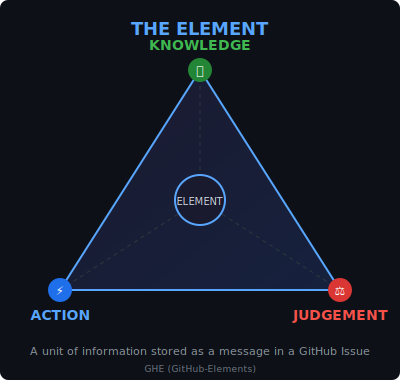

# GitHub Elements Plugin (GHE)

[](https://github.com/Emasoft/ghe-marketplace/releases/tag/v0.3.0)
[](LICENSE)
[](https://github.com/Emasoft/ghe-marketplace/issues)
[](https://github.com/Emasoft/ghe-marketplace/stargazers)
[](https://docs.anthropic.com/en/docs/claude-code)

A Claude Code plugin for using GitHub Issues as persistent memory with orchestrated DEV/TEST/REVIEW workflow management.

## Overview

GitHub Elements provides a complete system for:
- **Persistent Memory**: GitHub Issues survive context exhaustion
- **Workflow Orchestration**: Automated DEV -> TEST -> REVIEW lifecycle
- **Agent Coordination**: Specialized agents for each workflow phase (with unique robot avatars)
- **Memory Integration**: Syncs with SERENA memory bank
- **24/7 Automation**: Argos Panoptes monitors your repo via GitHub Actions

## Installation

### Via Claude Code CLI (Recommended)

```bash
claude plugin add Emasoft/ghe-marketplace
```

### Manual Installation

1. Download the latest release zip from [Releases](https://github.com/Emasoft/ghe-marketplace/releases)
2. Extract to `~/.claude/plugins/ghe/`
3. Restart Claude Code

### From Source

```bash
git clone https://github.com/Emasoft/ghe-marketplace.git
cp -r ghe-marketplace/plugins/ghe ~/.claude/plugins/
```

## Features

### The Circular Phase Order

```
        +--------------------------------------------+
        |                                            |
        v                                            |
    DEV --------> TEST --------> REVIEW -------------+
     |             |               |                 |
     |             |               v                 |
     |             |         PASS? -> merge to main  |
     |             |               |                 |
     |             |         FAIL? ------------------+
     |        Bug fixes ONLY       (to DEV, never TEST)
     |
 Development work
 (code + tests)
```

### Specialized Agents

> **"Enforce no Time, Only Order"**

Each agent has a unique **Greek god/mythology robot avatar** that appears in GitHub issue comments for visual identity.

| Agent | Persona | Model | Purpose |
|-------|---------|-------|---------|
| `github-elements-orchestrator` | **Athena** | opus | Central coordinator (wisdom) |
| `dev-thread-manager` | **Hephaestus** | opus | DEV thread lifecycle (forge/build) |
| `test-thread-manager` | **Artemis** | sonnet | TEST thread lifecycle (hunt bugs) |
| `review-thread-manager` | **Hera** | sonnet | REVIEW thread lifecycle (quality) |
| `phase-gate` | **Themis** | sonnet | Transition validation (justice) |
| `memory-sync` | **Mnemosyne** | haiku | SERENA memory sync (memory) |
| `enforcement` | **Ares** | haiku | Enforces rules, can suspend/block |
| `reporter` | **Hermes** | haiku | Messenger delivering reports |
| `ci-issue-opener` | **Chronos** | haiku | CI failure issues (time) |
| `pr-checker` | **Cerberus** | haiku | PR requirements (guardian) |

**Avatar System:**
- **Agent avatars**: Bundled locally in `assets/avatars/` (10 for agents + argos.png for GitHub Action + claude.png for assistant)
- **User avatars**: Fetched dynamically from GitHub API at runtime

---

## Argos Panoptes - The All-Seeing Guardian

> *"Argos Panoptes"* (Ancient Greek: Ἄργος Πανόπτης, "All-seeing Argos") was a giant with a hundred eyes in Greek mythology. He was a faithful guardian who never slept, as some of his eyes were always awake.

### What is Argos Panoptes?

**Argos Panoptes is NOT a Claude Code agent.** It is powered by the **Claude GitHub App** and runs as GitHub Actions workflows that monitor your repository 24/7, even when you are offline.

While the specialized agents (Hera, Hephaestus, Ares, Chronos) are local Claude Code subagents that require you to be online with an active Claude Code session, Argos Panoptes operates autonomously through GitHub's infrastructure.

### What Argos Does

Argos Panoptes serves as your repository's tireless sentinel:

1. **Monitors Events 24/7**: Watches for PRs, issues, comments, security alerts, and CI failures
2. **Triages Incoming Work**: Validates submissions, asks for missing information, applies labels
3. **Queues Work for Specialists**: Prepares issues for the appropriate agent to handle when you're online
4. **Maintains Order**: Prevents spam, flags policy violations, tracks CI health
5. **Never Impersonates**: Always identifies itself as "Argos Panoptes (The All-Seeing)" and clearly states which specialist agent will handle the work

### How Argos Differs from Local Agents

| Aspect | Argos Panoptes | Local Agents (Hera, Hephaestus, etc.) |
|--------|----------------|---------------------------------------|
| **Powered by** | Claude GitHub App | Claude Code CLI |
| **Runs when** | 24/7 (GitHub Actions) | Only during active sessions |
| **Can do** | Triage, label, comment, queue | Full development, testing, review |
| **Identity** | Own avatar and banner | Own avatars and banners |
| **Autonomy** | High (automated) | Supervised (you're online) |

### Installing Argos Panoptes

Argos requires the Claude GitHub App to be installed on your repository.

#### Step 1: Install the Claude GitHub App

Run this command in Claude Code:

```
/install-github-app
```

This command will:
- Guide you through GitHub OAuth authentication
- Create a pull request to add the Claude workflow to your repository
- Automatically configure the `CLAUDE_CODE_OAUTH_TOKEN` secret based on your subscription

**Note**: Only the repository owner can run this command. The setup varies based on your Anthropic subscription (Max Pro flat-rate, usage-based credits, etc.).

#### Step 2: Copy the GHE Workflow Files

After the Claude GitHub App is installed, copy the Argos workflows to your repository:

```bash
# From your repository root
mkdir -p .github/workflows
cp path/to/ghe-plugin/examples/github-actions/ghe-*.yml .github/workflows/
```

Or manually copy each workflow file from the `examples/github-actions/` directory.

#### Step 3: Verify Installation

Create a test issue with the `bug` label to verify Argos responds. You should see a comment from Claude with the Argos Panoptes avatar asking for bug report details or confirming the issue is ready for review.

### Events Argos Reacts To

When you're offline, Argos automatically processes these events and queues work for your next session:

| Event | Trigger | What Argos Does | Queued For |
|-------|---------|-----------------|------------|
| **A: PR Opened** | Someone opens a pull request | Creates a REVIEW issue linking to the PR, adds `review` and `source:pr` labels, comments on the PR with the queue issue link | Hera |
| **B: Bug Report** | Someone opens an issue with `bug` label | Validates the bug report template (description, steps to reproduce, expected vs actual behavior, environment). If complete: adds `review` and `ready` labels. If incomplete: adds `needs-info` label and politely asks for missing details | Hera |
| **C: Feature Request** | Someone opens an issue with `enhancement` or `feature` label | Validates the feature request (description, use case). If complete: adds `dev` and `ready` labels. If incomplete: adds `needs-info` label and asks for clarification | Hephaestus |
| **D: Policy Violation** | Someone posts a comment with harassment, threats, spam, or discrimination | Issues a warning (maximum 3 warnings per user). After 3 warnings: adds `needs-moderation` label for human review. Very conservative - when uncertain, does nothing | Ares |
| **E: SPAM Detected** | Someone posts obvious spam (requires 3+ indicators) | Closes the issue with `spam` label. Extremely conservative - only acts on obvious spam (new account + no activity + promotional links + crypto/gambling content). False positives are unacceptable | - |
| **F: Security Alert** | GitHub detects a Dependabot alert, code scanning alert, or secret scanning alert | Creates an URGENT issue with `dev`, `urgent`, and `security` labels. If critical severity: also adds `blocked` label. Never dismisses alerts | Hephaestus |
| **G: CI/CD Failure** | A workflow fails (excluding GHE workflows to prevent loops) | Creates or updates a CI failure issue with `review`, `ci-failure`, and `source:ci` labels. Tracks consecutive failures and adds `urgent` label after 3+ failures | Chronos |

### Argos Design Principles

1. **Conservative by Default**: When uncertain, Argos creates an URGENT issue and waits for human decision rather than taking autonomous action
2. **No False Positives**: Especially for SPAM and moderation - better to miss spam than block a legitimate user
3. **Respect User Autonomy**: Only the repository owner makes final decisions. Argos never bans, deletes, or takes irreversible actions
4. **Prevent Infinite Loops**: Argos workflows exclude bot actors and other GHE workflows to prevent cascading triggers
5. **No Deletions**: Issues are closed and labeled, never deleted (preserves complete audit trail)
6. **Clear Identity**: Always signs as "Argos Panoptes (The All-Seeing)" and explains which specialist will handle the work
7. **Meaningful Issue Titles**: All issues include an identifier number and descriptive context

### Issue Title Format

All issues use the format `[NUM][TYPE] description` - issue number first, then type:

| Type | Format | Example |
|------|--------|---------|
| Bug Report | `[<num>][BUG] <description>` | `[42][BUG] Login fails on Safari` |
| Feature | `[<num>][FEATURE] <description>` | `[43][FEATURE] Add dark mode` |
| PR Review | `[<num>][REVIEW] <title>` | `[44][REVIEW] Add user authentication` |
| Security | `[<num>][SECURITY] <sev>: <vuln>` | `[45][SECURITY] CRITICAL: RCE in lodash` |
| CI Failure | `[<num>][CI] <workflow> on <branch>` | `[46][CI] Tests failed on feature/auth` |

**Why this format?**
- Issue number FIRST for quick reference
- Type in brackets for visual scanning
- No redundant info (phase labels like DEV/TEST/REVIEW are in labels, not titles)

### What Argos Does NOT Flag as Violations

To avoid false positives, these are explicitly NOT considered violations:

- Mentioning other tools or projects positively
- Technical disagreements (even heated ones)
- Asking questions repeatedly
- Non-English comments
- Sarcasm or humor
- Respectful criticism of the project

### Argos Workflow Files

| Workflow | Event | Purpose |
|----------|-------|---------|
| `ghe-pr-review.yml` | A | Queue PRs for review |
| `ghe-bug-triage.yml` | B | Validate and triage bug reports |
| `ghe-feature-triage.yml` | C | Validate and triage feature requests |
| `ghe-moderation.yml` | D | Detect policy violations |
| `ghe-spam-detection.yml` | E | Conservative spam detection |
| `ghe-security-alert.yml` | F | Security vulnerability handling |
| `ghe-ci-failure.yml` | G | CI/CD failure tracking |

### Division of Labor: Argos vs Local Plugin

| Capability | Argos (GitHub Actions) | Local Plugin (Claude Code) |
|------------|------------------------|----------------------------|
| 24/7 Monitoring | Yes | No |
| Triage new issues/PRs | Yes | No |
| Validate templates | Yes | No |
| Apply labels | Yes | Yes |
| @claude mentions (basic Q&A) | Yes | Yes (full) |
| Claim issues | No | Yes |
| Post checkpoints | No | Yes |
| Transition phases | No | Yes |
| SERENA memory sync | No | Yes |
| Write/modify code | No | Yes |
| Run tests | No | Yes |
| Create PRs | No | Yes |

---

### Natural Language Operations

Just tell Claude what you want. These operation skills are discoverable:

| Say | Skill Activated | What Happens |
|-----|-----------------|--------------|
| "Show me the workflow status" | `ghe-status` | Spawns reporter agent |
| "Claim issue #201" | `ghe-claim` | Validates and claims with protocol |
| "Post a checkpoint" | `ghe-checkpoint` | Records state to active thread |
| "Transition to TEST" | `ghe-transition` | Validates and executes transition |
| "Give me a metrics report" | `ghe-report` | Generates detailed report |

### SessionStart Hook

Automatically loads active thread context when a session starts:
- Finds in-progress issues assigned to you
- Loads the last checkpoint state
- Activates the skill
- Syncs with SERENA memory bank

## Workflow Rules

### One Thread At A Time

For any feature/epic, only ONE thread can be open at a time:
- DEV -> close DEV, open TEST
- TEST -> close TEST, open REVIEW
- REVIEW PASS -> close REVIEW, merge
- REVIEW FAIL -> close REVIEW, reopen DEV

### Phase Responsibilities

| Phase | Can Do | Cannot Do |
|-------|--------|-----------|
| **DEV** | Write code, write tests, structural changes | Render verdicts |
| **TEST** | Run tests, fix simple bugs | Write new tests, structural changes |
| **REVIEW** | Evaluate, render verdicts | Write code, demote to TEST |

### Demotion Rules

- **REVIEW -> DEV**: Always (for any fixes)
- **TEST -> DEV**: When structural changes needed
- **REVIEW -> TEST**: NEVER (must go to DEV)

### Phase Promotion with Themis

When a thread manager (Hephaestus/Artemis/Hera) believes their phase is complete:

```
1. Manager writes completion report to issue
2. Manager adds `pending-promotion` label
3. Themis sees the label and reads the report
4. Themis decides: PROMOTE or REJECT
```

**Critical Rule**: The manager MUST write the report BEFORE adding the `pending-promotion` label. Themis looks for the label and immediately reads the last report to make a decision.

| Label | Added By | Meaning |
|-------|----------|---------|
| `pending-promotion` | Thread Manager | "I think my phase is done, Themis please evaluate" |
| `phase:dev` | Themis | Currently in DEV phase |
| `phase:test` | Themis | Currently in TEST phase |
| `phase:review` | Themis | Currently in REVIEW phase |

## Element Classification System

Every conversation exchange posted to GitHub Issues is classified with semantic badges that enable targeted memory recall.

### The Element Triangle

<p align="center">
  
</p>

Each element stored in a GitHub Issue comment is tagged with one or more classification badges:

<p align="center">
  
</p>

### Semantic Badges

| Badge | Type | Purpose |
|-------|------|---------|
|  | KNOWLEDGE | Plans, requirements, design, theory |
|  | ACTION | Code, assets, configs - actual changes |
|  | JUDGEMENT | Reviews, bugs, feedback, test results |

### Key Insight

> **Only ACTION elements change the project.** KNOWLEDGE and JUDGEMENT are discussion - they inform decisions but don't modify artifacts. In a video game project, 90% of ACTION elements might be asset uploads (sprites, 3D models, sounds) rather than code.

### Element-Based Memory Recall

When you need to recover specific information, query by element type:

```bash
# Find CODE/ASSETS (what we built)
recall-elements.sh --issue 201 --type action

# Find REQUIREMENTS/SPECS (what we planned)
recall-elements.sh --issue 201 --type knowledge

# Find BUGS/ISSUES (what went wrong)
recall-elements.sh --issue 201 --type judgement

# Smart session recovery (all context)
recall-elements.sh --issue 201 --recover
```

| What You Want to Recall | Element Type |
|------------------------|--------------|
| "What code did we write?" | ACTION |
| "What assets were created?" | ACTION |
| "What were the requirements?" | KNOWLEDGE |
| "What bugs did we find?" | JUDGEMENT |
| "What feedback was given?" | JUDGEMENT |

---

## Memory Integration

### Three-Tier Storage

```
Tier 1: TodoWrite         (Session - transient)
        |
        v
Tier 2: GitHub Elements   (Persistent - 64KB limit)
        |
        v
Tier 3: SERENA Memory     (Archive - unlimited)
```

### SERENA Memory Structure

```
.serena/memories/
├── activeContext.md    # Current session focus
├── progress.md         # Completed work
├── techContext.md      # Technical decisions
├── dataflow.md         # System interfaces
├── projectBrief.md     # Project overview
└── test_results/       # Test execution records
```

## Usage Examples

### Start Work on a Feature

```
User: "Show me the workflow status"
Claude: [Spawns reporter, shows active/available work]

User: "Claim issue #201"
Claude: [Validates phase order, claims issue, posts comment, sets up worktree]

... do development work ...

User: "Post a checkpoint"
Claude: [Gathers state, posts checkpoint to issue, syncs memory]

User: "I'm done with DEV, transition to TEST"
Claude: [Validates transition, closes DEV, opens TEST thread]
```

### Run Maintenance Cycle

```
User: "Run a maintenance cycle on the github elements workflow"

Claude: [Spawns orchestrator which:
  1. Spawns reporter for status
  2. Checks each thread with phase-gate
  3. Executes any needed transitions
  4. Syncs memory bank
  5. Checks for violations
  6. Reports summary back]
```

## Plugin Structure

```
ghe/
├── .claude-plugin/
│   └── plugin.json           # Plugin manifest
├── skills/
│   ├── github-elements-tracking/
│   │   ├── SKILL.md          # Main skill
│   │   └── references/       # Playbooks (P1-P10)
│   ├── ghe-status/           # Status operation skill
│   ├── ghe-claim/            # Claim operation skill
│   ├── ghe-checkpoint/       # Checkpoint operation skill
│   ├── ghe-transition/       # Transition operation skill
│   └── ghe-report/           # Report operation skill
├── agents/
│   ├── github-elements-orchestrator.md  # Athena
│   ├── dev-thread-manager.md            # Hephaestus
│   ├── test-thread-manager.md           # Artemis
│   ├── review-thread-manager.md         # Hera
│   ├── phase-gate.md                    # Themis
│   ├── memory-sync.md                   # Mnemosyne
│   ├── enforcement.md                   # Ares
│   ├── reporter.md                      # Hermes
│   ├── ci-issue-opener.md               # Chronos
│   └── pr-checker.md                    # Cerberus
├── assets/
│   ├── avatars/                  # Robot avatar PNGs (12 total)
│   ├── element-triangle.svg      # Element concept diagram
│   └── element-classification.svg # 3-column classification table
├── scripts/
│   ├── auto-transcribe.sh    # Issue auto-transcription with element classification
│   ├── recall-elements.sh    # Element-based memory recall CLI
│   ├── post-with-avatar.sh   # Avatar comment helper
│   ├── parse-settings.sh     # Settings parser
│   ├── safeguards.sh         # Safety checks
│   └── check-issue-set.sh    # Issue validation
├── hooks/
│   └── hooks.json            # Hook definitions
├── commands/
│   └── setup.md              # /ghe:setup command
├── examples/
│   └── github-actions/       # Argos Panoptes workflows
├── docs/                     # Additional documentation
├── LICENSE                   # MIT License
└── README.md
```

## Configuration

GitHub Elements supports per-project configuration via `.claude/ghe.local.md`.

### Quick Setup

Run the setup command to configure interactively:

```
/ghe:setup
```

This prompts for your preferences and creates the settings file.

### Manual Configuration

Create `.claude/ghe.local.md` in your project:

```markdown
---
enabled: true
enforcement_level: standard
serena_sync: true
auto_worktree: false
checkpoint_interval_minutes: 30
notification_level: normal
default_reviewer: "your-github-username"
epic_label_prefix: "epic:"
---

# GitHub Elements Configuration

Your custom notes and context here.
```

### Settings Reference

| Setting | Values | Default | Description |
|---------|--------|---------|-------------|
| `enabled` | true/false | true | Enable/disable plugin entirely |
| `enforcement_level` | strict/standard/lenient | standard | Rule strictness |
| `serena_sync` | true/false | true | Sync with SERENA memory bank |
| `auto_worktree` | true/false | false | Auto-create git worktree on claim |
| `checkpoint_interval_minutes` | 0/15/30/60 | 30 | Reminder interval (0=disabled) |
| `notification_level` | verbose/normal/quiet | normal | Output verbosity |
| `default_reviewer` | string | "" | Default GitHub reviewer username |
| `epic_label_prefix` | string | "epic:" | Prefix for epic labels |

### Enforcement Levels

- **strict**: Block violations, require all criteria, no exceptions
- **standard**: Warn on first violation, block on repeat, allow override with reason
- **lenient**: Advisory only, log but don't block

### Gitignore

Settings files are user-local and should not be committed:

```gitignore
# Add to .gitignore
.claude/*.local.md
```

### Changing Settings

After editing `.claude/ghe.local.md`, restart Claude Code for changes to take effect. Hooks cannot be hot-swapped within a session.

## Prerequisites

- GitHub CLI (`gh`) installed and authenticated
- Git repository with GitHub remote
- (Optional) SERENA MCP for memory bank integration

## License

MIT License - See [LICENSE](LICENSE) for details.

## Author

[Emasoft](https://github.com/Emasoft)

## Contributing

Issues and pull requests welcome at [ghe-marketplace](https://github.com/Emasoft/ghe-marketplace).
